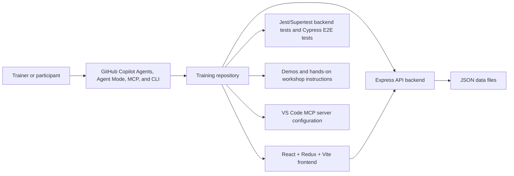

# Book Favorites App

> [!NOTE]
> This is a demo repository to be used during the GitHub Copilot Agents and MCP training session.

## Functional

The repository has two connected purposes:

- Provide trainer-led demos and participant exercises for GitHub Copilot Cloud Agent, Copilot Chat Agent Mode, MCP-enabled workflows, and GitHub Copilot CLI.
- Provide the Book Favorites full-stack web application that acts as the safe training target for those demos and exercises.

Book Favorites allows users to:
- Register for a new account or log in with existing credentials
- Browse a curated list of 50 books
- Search and sort the book catalog
- Add books to, remove books from, and clear their personal favorites list
- View their favorite books in a dedicated section
- Enjoy a clean, modern, and responsive user interface
- Experience protected routes (only logged-in users can access book and favorites pages)

## Technical

- **Frontend:**
  - Built with React, Redux Toolkit, and React Router
  - Uses CSS Modules for modular, responsive, and modern styling
  - State management for user authentication, books, and favorites via Redux slices
  - JWT-based authentication; tokens are stored in localStorage and sent with API requests
  - Uses `VITE_API_BASE_URL` to configure the backend API endpoint
  - Protected routes and navigation for a seamless UX

- **Backend:**
  - Node.js with Express.js for RESTful API endpoints
  - User authentication with JWT (JSON Web Tokens)
  - JWT secrets are read from `JWT_SECRET`
  - New passwords are stored as salted PBKDF2 hashes, with legacy plaintext demo users migrated on login
  - Data persistence using JSON files (`books.json` and `users.json`)
  - Modular route structure for authentication, books, and favorites
  - CORS enabled for frontend-backend communication
  - Books API supports search, sorting, and pagination query parameters
  - Favorites API supports add, remove, and clear operations

- **Other:**
  - Responsive design for desktop and mobile
  - Clear empty states and error handling
  - Modern UI/UX with attention to navigation and feedback

## Architecture



---

## Setup

1. **Clone the repository:**
   ```bash
   git clone <repo-url>
   cd <repo-name>
   ```

2. **Install dependencies:**
  ```bash
    npm run setup
  ```

3. **Configure environment variables:**
   ```bash
   cp .env.example .env
   cp frontend/.env.example frontend/.env
   ```
   Set `JWT_SECRET` to a long random value before using the app outside local demos.

4. **Run the backend server:**
    ```bash
    npm run start:backend
    ```
   The backend runs on [http://localhost:4000](http://localhost:4000)

   

5. **Run the frontend app:**

   Open a second terminal.

   ```bash
   npm run start:frontend
   ```
   The frontend runs on [http://localhost:5173](http://localhost:5173)

   

6. **Run the tests (optional):**

   ```bash
   npm run test:backend
   npm run build:frontend && npm run test:frontend
   cd frontend && npm run lint
   ```

   

7. **Usage:**
    - Register a new account or log in with an existing one (`sandra`/`sandra`)).
    - Browse books, add favorites, and enjoy the app!

## Recommended training path

1. Start with `demos/01-coding-agent-basic.md` to show a small Copilot Cloud Agent change.
2. Use `hands-on/01-coding-agent-exercises.md` so participants practice issue-driven changes.
3. Move to Agent Mode demos and exercises for local codebase understanding.
4. Introduce MCP with the advanced security and issue-coordination scenarios.
5. Close with the Copilot CLI exercises for repository exploration and terminal workflows.

## Troubleshooting

- If frontend API calls fail, verify `VITE_API_BASE_URL` points to the backend, usually `http://localhost:4000/api`.
- If login tokens stop working after a backend restart, set a stable `JWT_SECRET`.
- If E2E tests fail because ports are already in use, stop other backend/frontend dev servers and rerun `npm run build:frontend && npm run test:frontend`.
- If dependencies are missing, rerun `npm run setup`.
